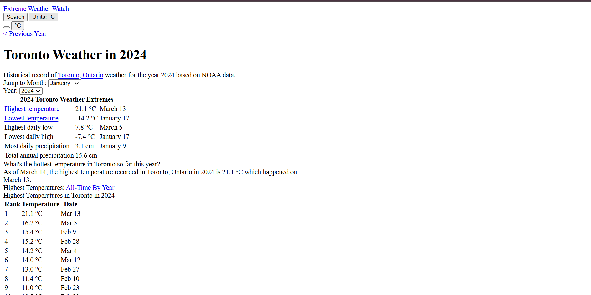

# CSV Data Analyzer in Microcontroller Environment

This project is a Python-based tool for analyzing Toronto's weather history records. It is designed to operate on a **Raspberry Pi-powered semi-hosted web server**, combining Linux bash scripts and Python for data processing and presentation. The system provides dynamic filtering and analysis of historical weather data with functionalities like "All-time averages" and "Trends."

---

## Features

- **Historical Data Analysis**:
  - Calculate averages, trends, and other metrics from historical weather data.
  - Filter data dynamically by year, month, or day.

- **Dynamic Web Interface**:
  - Presents processed data clearly and interactively on a web server hosted on a Raspberry Pi.
  - Displays key metrics such as highest/lowest temperatures, precipitation, and trends.

- **CSV File Management**:
  - Processes over 100 years of weather data from CSV files.
  - Generates consolidated and filtered data dynamically.

---

## Screenshots

### **CSV Files Structure**
The project processes weather data stored as CSV files, dynamically generating summaries and filtered results.


### **Web Interface**
The user-friendly web interface displays the processed data dynamically, making it easy to analyze weather trends.


---

## Technologies Used

- **Python**: Core language for data processing and analysis.
- **Linux Bash**: Scripts for managing files and semi-hosting the web server.
- **Raspberry Pi**: Hardware platform for hosting the system and web server.
- **HTML**: For building the web interface to display results dynamically.

---

## How to Run

1. **Setup the Raspberry Pi**:
   - Ensure Python and necessary packages (e.g., Flask, pandas) are installed.
   - Deploy the project files to the Raspberry Pi.

2. **Prepare Data**:
   - Place the CSV files containing weather data in the specified directory.
   - Ensure files are named correctly (e.g., `toronto_weather_1840.csv`, `toronto_weather_2024.csv`).

3. **Start the Server**:
   - Run the bash script `startWeb`:
     ```bash
     ./startWeb
     ```
   - The server will host the dynamic webpage accessible via the Raspberry Pi's IP address.

4. **Access the Web Interface**:
   - Open a browser and navigate to the Raspberry Pi's IP address to view the weather data analysis.

---

## Project Structure

- **CSV Data**: Historical weather data files (e.g., `toronto_weather_1840.csv` to `toronto_weather_2024.csv`).
- **Python Scripts**:
  - `get_pi_info.py`: System information utility.
  - `create_all_csv_files.py`: Processes raw weather data into meaningful datasets.
  - `version2.py`: Core script for analyzing and displaying weather data dynamically.
- **Web Server**:
  - `startWeb`: Bash script to initialize the semi-hosted web server.

---

## Future Enhancements

- **Real-Time Updates**:
  - Integrate live weather data for continuous updates.
- **Advanced Analytics**:
  - Include more statistical metrics such as standard deviations and year-over-year comparisons.
- **Enhanced UI**:
  - Upgrade the web interface for a modern look and feel.

---

## License

This project is licensed under the MIT License. See the [LICENSE](LICENSE) file for details.

---

Feel free to contribute or modify this project to suit your requirements. Let me know if additional features or explanations are needed!
